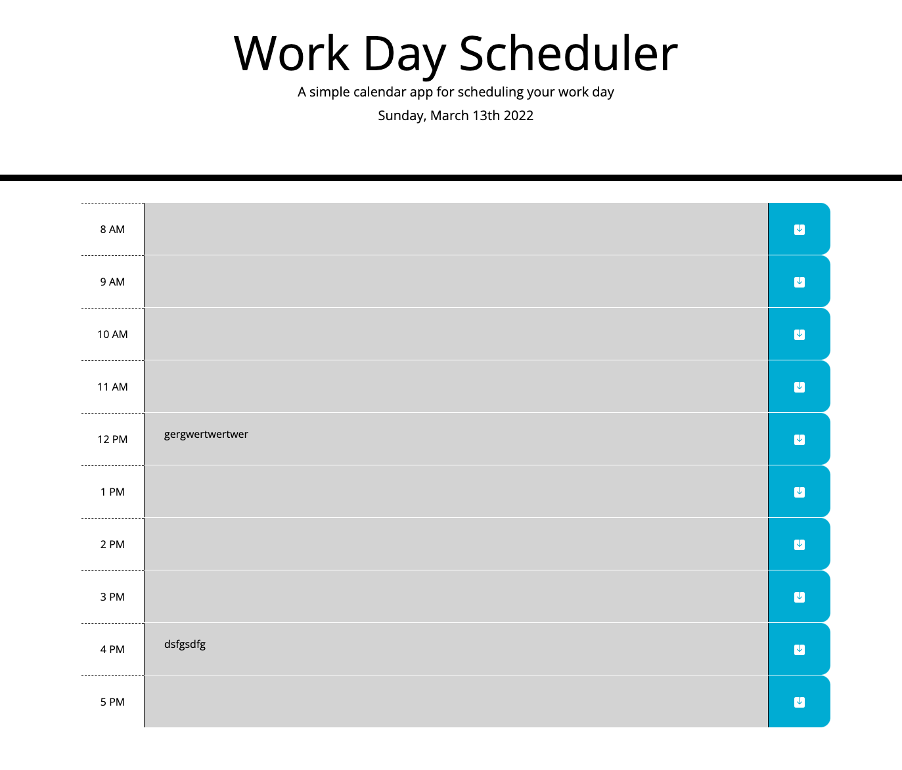
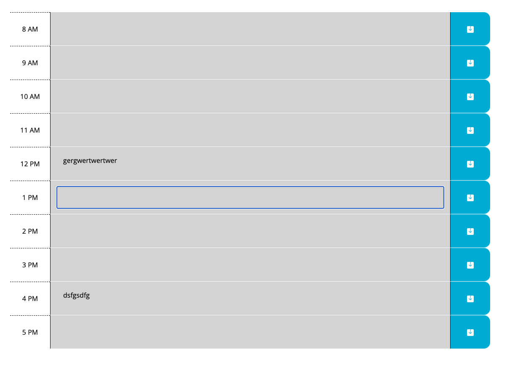
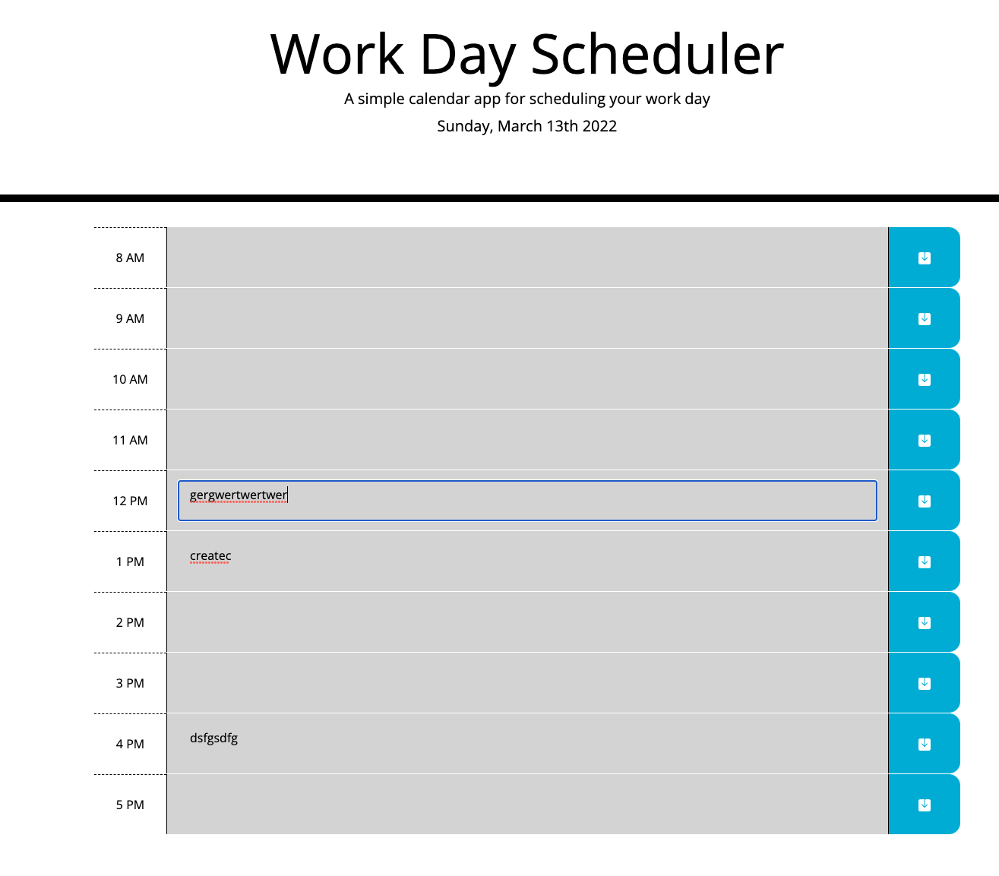

# Work Day Scheduler
This is a daily scheduler, you can not save tasks in future or see events of the past

Events will be deleted from localstorage once in a day

##Technologies used
    * Bootstrap CSS
    * Bootsrap icons
    * JQuery
    * Moment.js

# link to live
[Scheduler](https://ramumakkena.github.io/scheduleplanner/)

# Developer
Ramu Makkena

# Flow
    ##HomePage
    
    ##CreateNewTask
    
    ##EditCurrent
    
